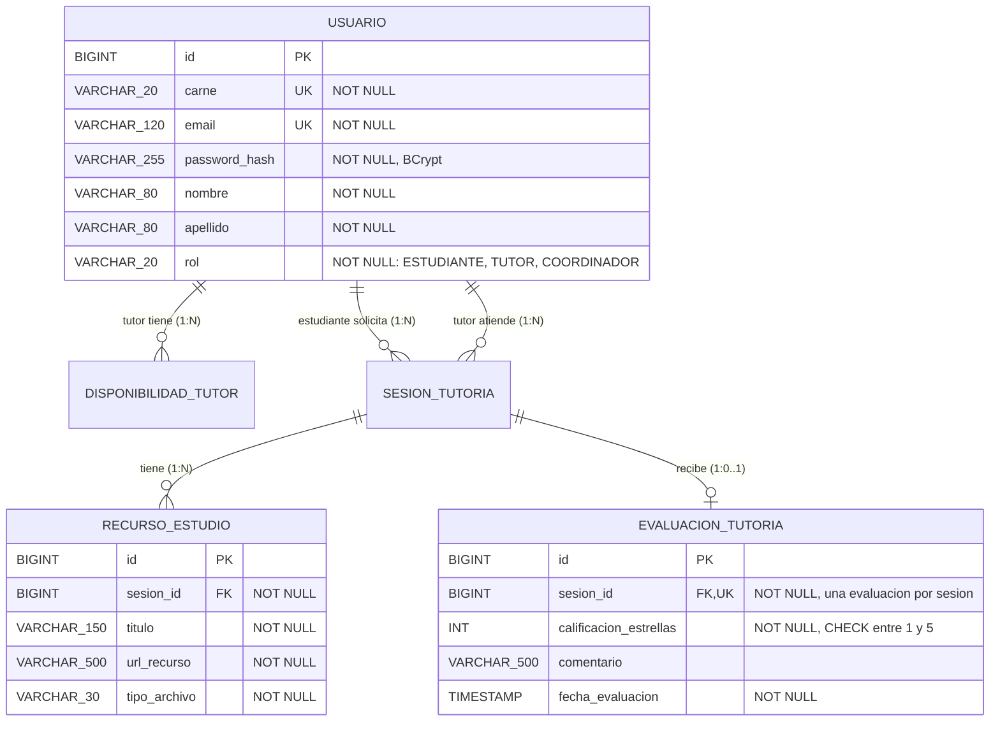

# Modelo Entidad-Relación

```mermaid
erDiagram
    USUARIO {
        BIGINT id PK
        VARCHAR_20 carne UK "NOT NULL"
        VARCHAR_120 email UK "NOT NULL"
        VARCHAR_255 password_hash "NOT NULL, BCrypt"
        VARCHAR_80 nombre "NOT NULL"
        VARCHAR_80 apellido "NOT NULL"
        VARCHAR_20 rol "NOT NULL: ESTUDIANTE, TUTOR, COORDINADOR"
    }
    RECURSO_ESTUDIO {
        BIGINT id PK
        BIGINT sesion_id FK "NOT NULL"
        VARCHAR_150 titulo "NOT NULL"
        VARCHAR_500 url_recurso "NOT NULL"
        VARCHAR_30 tipo_archivo "NOT NULL"
    }
    EVALUACION_TUTORIA {
        BIGINT id PK
        BIGINT sesion_id FK,UK "NOT NULL, una evaluacion por sesion"
        INT calificacion_estrellas "NOT NULL, CHECK entre 1 y 5"
        VARCHAR_500 comentario
        TIMESTAMP fecha_evaluacion "NOT NULL"
    }
    USUARIO ||--o{ DISPONIBILIDAD_TUTOR : "tutor tiene (1:N)"
    USUARIO ||--o{ SESION_TUTORIA : "estudiante solicita (1:N)"
    USUARIO ||--o{ SESION_TUTORIA : "tutor atiende (1:N)"
    SESION_TUTORIA ||--o{ RECURSO_ESTUDIO : "tiene (1:N)"
    SESION_TUTORIA ||--o| EVALUACION_TUTORIA : "recibe (1:0..1)"
```

Las demás entidades (Materia, DisponibilidadTutor y SesionTutoria) las agrega cada responsable en su rama; el diagrama final se integra al cierre.