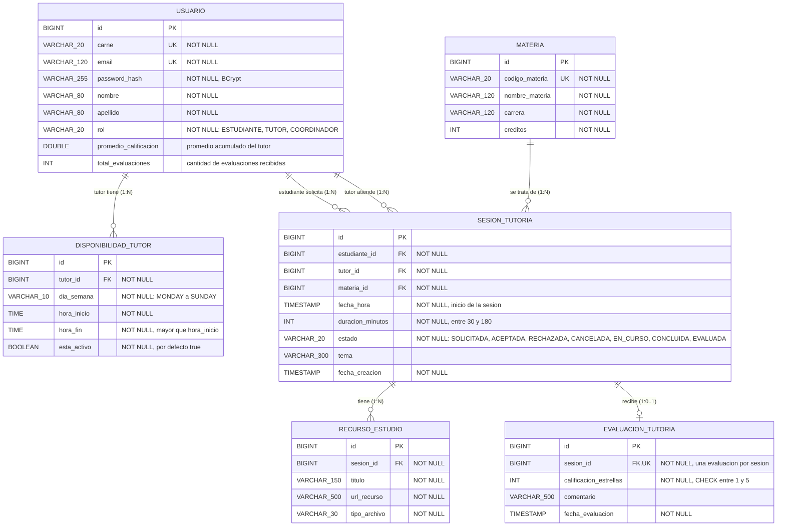

# Modelo Entidad-Relación

```mermaid
erDiagram
    USUARIO {
        BIGINT id PK
        VARCHAR_20 carne UK "NOT NULL"
        VARCHAR_120 email UK "NOT NULL"
        VARCHAR_255 password_hash "NOT NULL, BCrypt"
        VARCHAR_80 nombre "NOT NULL"
        VARCHAR_80 apellido "NOT NULL"
        VARCHAR_20 rol "NOT NULL: ESTUDIANTE, TUTOR, COORDINADOR"
        DOUBLE promedio_calificacion "promedio acumulado del tutor"
        INT total_evaluaciones "cantidad de evaluaciones recibidas"
    }
    MATERIA {
        BIGINT id PK
        VARCHAR_20 codigo_materia UK "NOT NULL"
        VARCHAR_120 nombre_materia "NOT NULL"
        VARCHAR_120 carrera "NOT NULL"
        INT creditos "NOT NULL"
    }
    DISPONIBILIDAD_TUTOR {
        BIGINT id PK
        BIGINT tutor_id FK "NOT NULL"
        VARCHAR_10 dia_semana "NOT NULL: MONDAY a SUNDAY"
        TIME hora_inicio "NOT NULL"
        TIME hora_fin "NOT NULL, mayor que hora_inicio"
        BOOLEAN esta_activo "NOT NULL, por defecto true"
    }
    SESION_TUTORIA {
        BIGINT id PK
        BIGINT estudiante_id FK "NOT NULL"
        BIGINT tutor_id FK "NOT NULL"
        BIGINT materia_id FK "NOT NULL"
        TIMESTAMP fecha_hora "NOT NULL, inicio de la sesion"
        INT duracion_minutos "NOT NULL, entre 30 y 180"
        VARCHAR_20 estado "NOT NULL: SOLICITADA, ACEPTADA, RECHAZADA, CANCELADA, EN_CURSO, CONCLUIDA, EVALUADA"
        VARCHAR_300 tema
        TIMESTAMP fecha_creacion "NOT NULL"
    }
    RECURSO_ESTUDIO {
        BIGINT id PK
        BIGINT sesion_id FK "NOT NULL"
        VARCHAR_150 titulo "NOT NULL"
        VARCHAR_500 url_recurso "NOT NULL"
        VARCHAR_30 tipo_archivo "NOT NULL"
    }
    EVALUACION_TUTORIA {
        BIGINT id PK
        BIGINT sesion_id FK,UK "NOT NULL, una evaluacion por sesion"
        INT calificacion_estrellas "NOT NULL, CHECK entre 1 y 5"
        VARCHAR_500 comentario
        TIMESTAMP fecha_evaluacion "NOT NULL"
    }
    USUARIO ||--o{ DISPONIBILIDAD_TUTOR : "tutor tiene (1:N)"
    USUARIO ||--o{ SESION_TUTORIA : "estudiante solicita (1:N)"
    USUARIO ||--o{ SESION_TUTORIA : "tutor atiende (1:N)"
    MATERIA ||--o{ SESION_TUTORIA : "se trata de (1:N)"
    SESION_TUTORIA ||--o{ RECURSO_ESTUDIO : "tiene (1:N)"
    SESION_TUTORIA ||--o| EVALUACION_TUTORIA : "recibe (1:0..1)"
```
